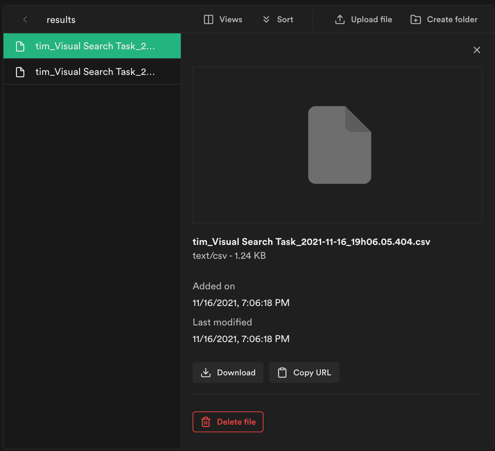
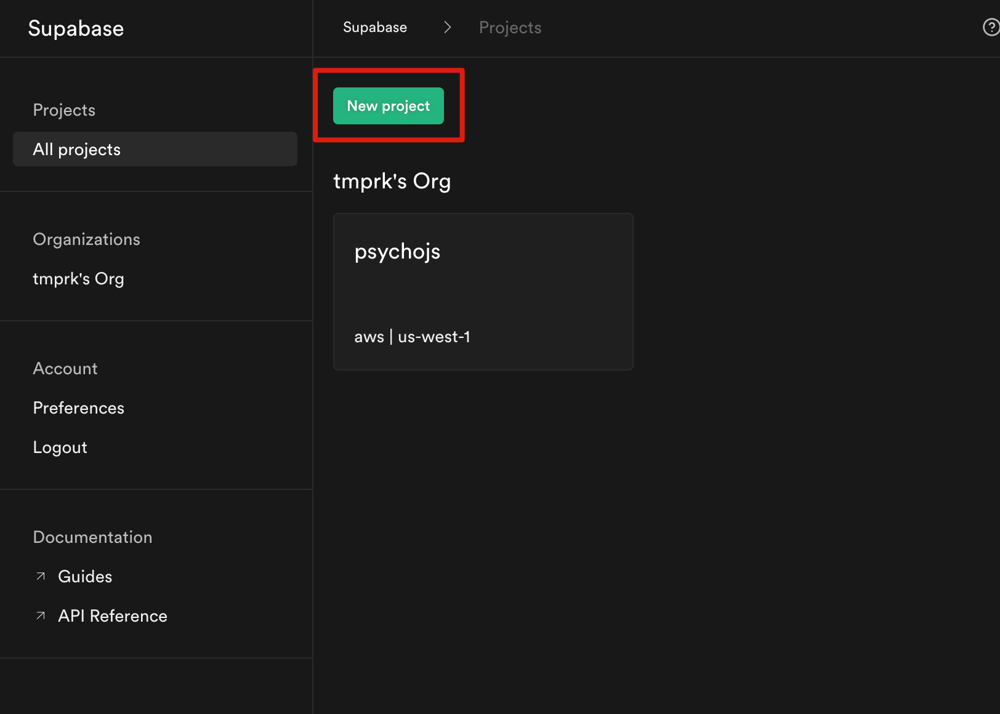
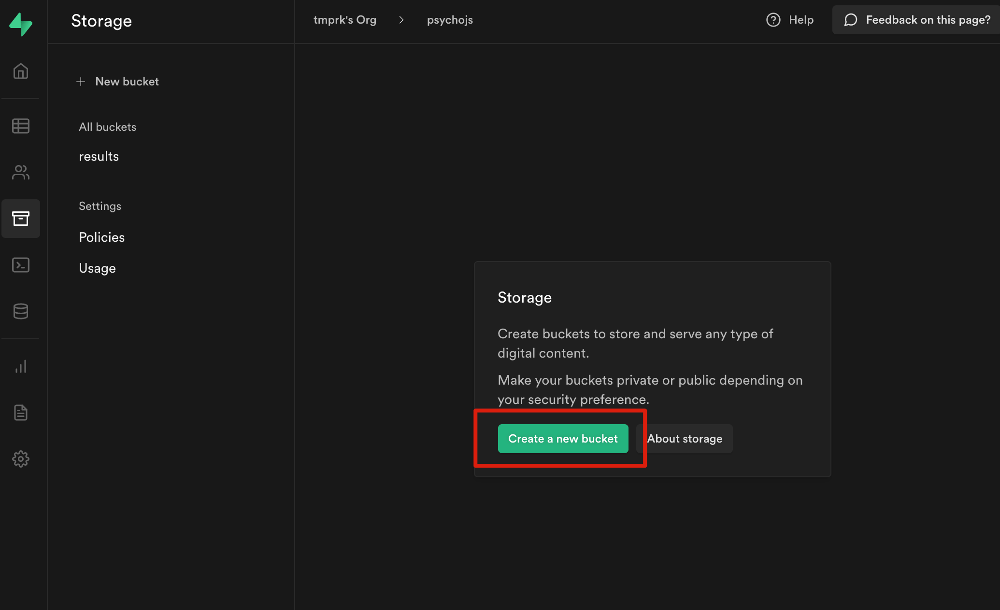
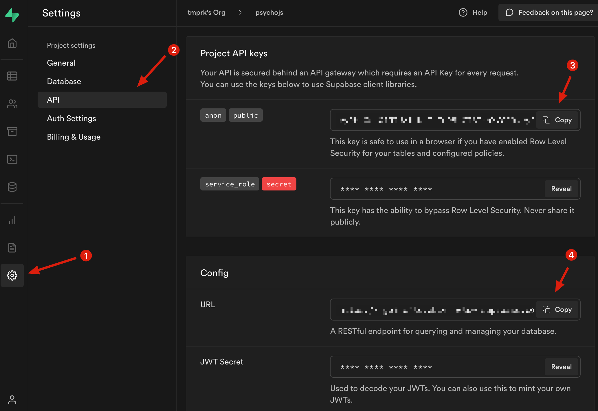
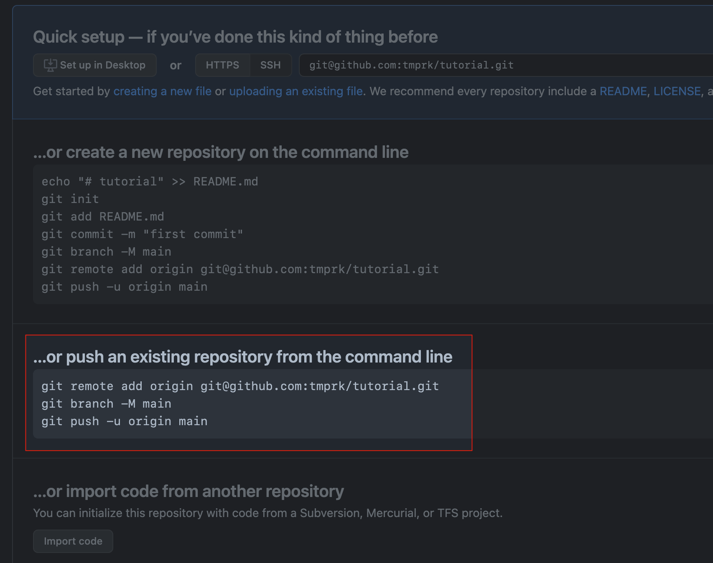
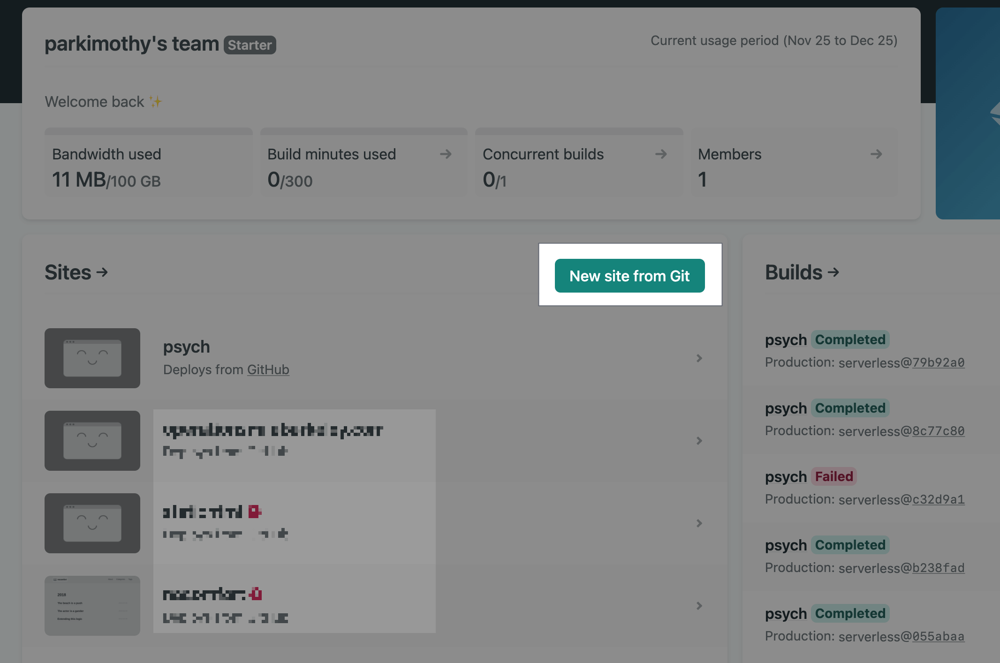
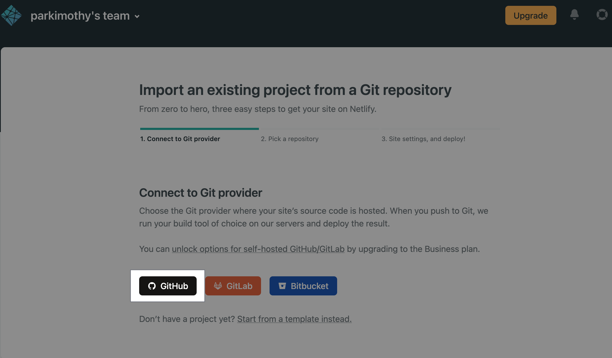
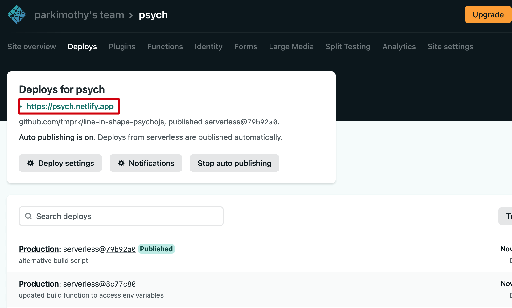

# Line-in-shape written using PsychoJS

## Problem

A Python script that runs psychopy code can only be used on the device it is installed on and cannot be deployed on the web. Even the GUI library that psychopy uses to create a window is specific to desktop computers.

As a result, the PsychoPy organization created some scripts to convert a psychopy project to psychojs. Everything would be fine if the program written in the previous section could be converted to javascript and uploaded to pavlovia.

It turns out that only experiments made in the PsychoPy *Builder*, can be converted using a script. Initially, I thought that any code that involves psychopy could be converted to psychoJS and then run on Pavlovia but I was wrong about this.

## Solution

The Javascript framework, [PsychoJS](https://psychopy.github.io/psychojs/) that psychopy is automatically converted to from the builder can be used to write your own programs from scratch.

As a result, I decided to just translate the python code to javascript. The main logic was already written, so it just needed to be translated, with a few other nuances. Read [manual coding of PsychoJS studies](https://www.psychopy.org/online/psychojsCode.html), which described my situation perfectly.

## Key parts of the solution

PsychoJS library doesn't require any interface with a server to display shapes and accept keystrokes, etc. As a result, I decided to dabble in serverless and host the core program and Netlify Functions ✨, and call the lambda functions. In the words of netlify:

> *Deploy server-side code that works as API endpoints, runs automatically in response to events, or processes more complex jobs in the background.*
> 
> *Functions receive request context or event data, and return data back to your front end.*

This is perfect because everything up until the CSV upload is local; the keystroke input, trial results, and CSV formatting are all done in javascript on the browser. Once all the this happens, the plan was to call a function endpoint (passing in the CSV data through the event body) and my function would handle the data and upload it somewhere safe.

In addition to the actual program written in PsychoJS, here is a simple Netlify function I used:

```javascript
// Grab our credentials from a .env file or environment variables
require('dotenv').config();
const { DATABASE_URL, SUPABASE_SERVICE_API_KEY } = process.env;

// Connect to our database
const { createClient } = require('@supabase/supabase-js');
const supabase = createClient(DATABASE_URL, SUPABASE_SERVICE_API_KEY);

// Our standard serverless handler function
exports.handler = async event => {
    if (event.httpMethod == 'POST') {
        console.log(typeof(event.body))
        console.log('body:', event.body, '\n')
        console.log('filename:', JSON.parse(event.body).filename, '\n')
        console.log('contents:', JSON.parse(event.body).csv, '\n')

        const body = JSON.parse(event.body)
        const filename = body.filename
        const contents = body.csv

        // Insert a row
        const { data, error } = await supabase.storage
            .from('results')
            .upload(filename, contents, {
                contentType: 'text/csv'
            })

        // Did it work?
        if (data) {
            console.log(data);
            return {
                statusCode: 200,
                body: JSON.stringify({
                    message: 'sent a post request containing blob'
                }),
            }
        } else {
            console.log(error);
            return {
                statusCode: 500,
                body: JSON.stringify({
                    message: "POST didn't go through"
                }),
            }
        }
    }
}
```

In order for the psychojs program to call this endpoint by itself, I added this snippet to the PsychoJS code. This goes in uploadData(key, value) of [`ServerManager.js`](https://github.com/psychopy/psychojs/blob/8943dee36b5aa0a44a0cc34a5d5773cb1bb45465/src/core/ServerManager.js).

```javascript
const self = this;
const URL = '/api/upload-csv' // Netlify function is located here!!!
			
return new Promise((resolve, reject) => {
    let type = "text/csv"
    // value is the comma separated value passed into the function
    const blob = new Blob([value], { type });
    fetch(URL, {
        method: 'post',
        headers: {
            'Accept': 'application/json, text/plain, */*',
            'Content-Type': 'application/json'
        },
        body: JSON.stringify({ filename: key, csv: value })
    }).then(res => res.json())
        .then(res => console.log(res));
});
```

## How to use the program

I actually have a version deployed right now. It is located on the domain `psych dot netlify dot app` (doing this to prevent bots). Just navigate to this domain and you can try it out. It will look something like this minus the developer tools on the right side, which was for debugging purposes.



The program will let you know when the experiment has ended. However, where did the data hosted? As you may have seen earlier in the Netlify function, [supabase](https://supabase.com/) is used as a datastore. When I navigate to my supabase storage dashboard, I see a list of CSVs that can be downloaded:

<p align="center">
  
</p>

## How to install it on your own

Great, now you're ready to download the code and make some tweaks. Before you clone the repository containing the code, there are some prerequisites:
1. If you're on mac, [brew](https://brew.sh/) package manager. If you're on windows move to the next step.
2. Node and npm, for javascript runtime (local server)

For mac users:
```bash
brew install node
node --version # to check if it's there
```

For windows users: navigate to [nodejs.org](https://nodejs.org/en/download/) and get the latest version.

3. Open Terminal on mac, or Command prompt on Windows and download the Netlify dev cli (for testing locally).
```bash
# Install the Netlify CLI
npm install netlify-cli -g
```

&nbsp;

Once you have all of these, you're can now test the core psychojs program and the netlify functions (these are included in the repository). First clone this [this](https://github.com/tmprk/line-in-shape-psychojs/) github repository.

```bash
git clone https://github.com/tmprk/line-in-shape-psychojs/tree/serverless

cd line-in-shape-psychojs # change directory to the code
ls # list contents of directory

# this should be what it looks like
└── psychopy
    ├── functions
    ├── library
    ├── scripts
    ├── index.html
    ├── netlify.toml
    ├── package.json
    ├── stimulus.js
    ├── visual-search-legacy-browsers.js
    └── visual-search.js
```

If you try to run `netlify dev` or any local server to test out your program, it will not work, as many of the essential javascript dependencies are missing. The code you cloned does not include these dependences (because they take up space) but has a list of them in `package.json`. Run `npm install` in the root of the project. You should now see `node_modules`, which are used by the program.

Next, run the Netlify dev tools in the root of the project
```bash
netlify dev

# it should output something like this
◈ Netlify Dev ◈
◈ Ignored build settings env var: DATABASE_URL (defined in .env file)
◈ Injected .env file env var: DATABASE_URL
◈ Ignored build settings env var: SUPABASE_SERVICE_API_KEY (defined in .env file)
◈ Injected .env file env var: SUPABASE_SERVICE_API_KEY
◈ Ignored general context env var: LANG (defined in process)
◈ Ignored general context env var: LC_ALL (defined in process)
◈ No app server detected. Using simple static server
◈ Unable to determine public folder to serve files from. Using current working directory
◈ Setup a netlify.toml file with a [dev] section to specify your dev server settings.
◈ See docs at: https://cli.netlify.com/netlify-dev#project-detection
◈ Running static server from "line-in-shape-personal"
◈ Loaded function upload-csv.
◈ Functions server is listening on 52182

◈ Static server listening to 3999
```

Navigate to http://localhost:3999, or replace 3999 with whatever the output says the static server is running on. You should now see the PsychoJS program! One problem, when you finish the experiment and the program tries to upload, it is unable to because no API keys are provided. To do this, you need your own supabase account and create a bucket to hold the CSVs. This next part should help accomplish that.

## Collecting CSV data (and self-hosting methods)

To get a datastore yourself or your own organization, there are many options. You can you Amazon AWS, MongoDB, Fauna DB, the list goes on. I just chose supabase because I was having issues getting AWS Dynamo DB to work. First, sign up with Supabase using the third-party Github login. On your supabase dashboard, click "New Project" and name it accordingly.

<p align="center">
  
</p>

After creating a project, a storage bucket must be created. Go to the storage icon on the left navigation bar, and click "Create a new bucket"

<p align="center">
  
</p>

Now that these things are created, we need to retrieve the database URL, API keys and access token. The database URL is an individual identifier for your project, and the API keys and access token are secret key that can be used to interact with the database (read and write data) and are used in the code. To get these things, look for the settings icon on the left. Click the icon > click API. You should see various fields that can be copied.

<p align="center">
  
</p>

The top one (3) is the API key. The bottom one (4) is the database URL. These will both need to be added to your code so you can send the data to your own instance. To do this, create an `.env` file in the root of your project. This is an environment file and contains keys that should not be exposed to the public. Once you place these in the .env file, they will be read by the netlify function, so that it can run the code that uploads the CSV.

```bash
# in root of project in terminal
touch .env
nano .env # or open in your text editor

# paste these using nano, or in editor
DATABASE_URL={the data base URL you copied}
SUPABASE_SERVICE_API_KEY={your api key}
```

## Let Netlify read your Github repo

Now that you have it running locally, it should also be able to upload the CSVs to your supabase bucket as well. To get this deployed on netlify (for now, since we're using netlify functions), you will have to first push the code to Github. After adding your API keys to the `.env` file, the code is now ready for upload.

Create a new Github repo on the website. Name it whatever you like. It lists out several ways to get your code onto the empty repo. What you're interested in is the bottom section.

<p align="center">
  
</p>

```bash
# since you cloned the repo, you need a *new* remote url to push to

# in the root of the project
git remote set-url origin git@github.com{your-username}/{repo name}.git
git branch -M main
git push -u origin main
```

Now you have to sign up with Netlify. They have a generous free tier of 125,000 requests per month, plenty of bandwidth for your site, and build minutes. Once you sign up, there will be a button that says "new site from git". It will direct you to several options to authenticate with, so Netlify can read only the github repos you permit.

new site from git    |  connect repo
:-------------------------:|:-------------------------:
  |  

Once you select the repo that you gave Netlify access to, it will start building the site. It creates a build environment to set everything up. If everything goes to plan, the build should have succeeded. It should provide you a URL, which can be renamed in the site settings.

<p align="center">
  
</p>

You can now access this site from anywhere in the world! If you've made it this far, then congratulations.

## Moving forward

If there are any suggestions, improvements, or issues encountered along the way, feel free to reach out via [email](mailto:parkimothy@gmail.com).

Some things I would like to add to this (tentative list):
1. Authentication via code given by research coordinator
   - With the domain in the public, anyone can access and the program may be prone to bots and DOS'ing (highly unlikely for something so niche but could happen).
   - Since it's static, we can't perform authentication so we would have to resort to Netlify functions again. Entirely possible though.