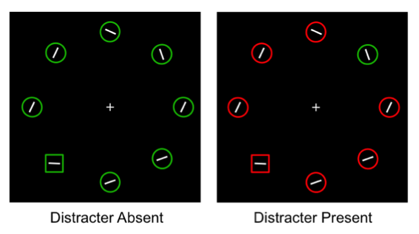
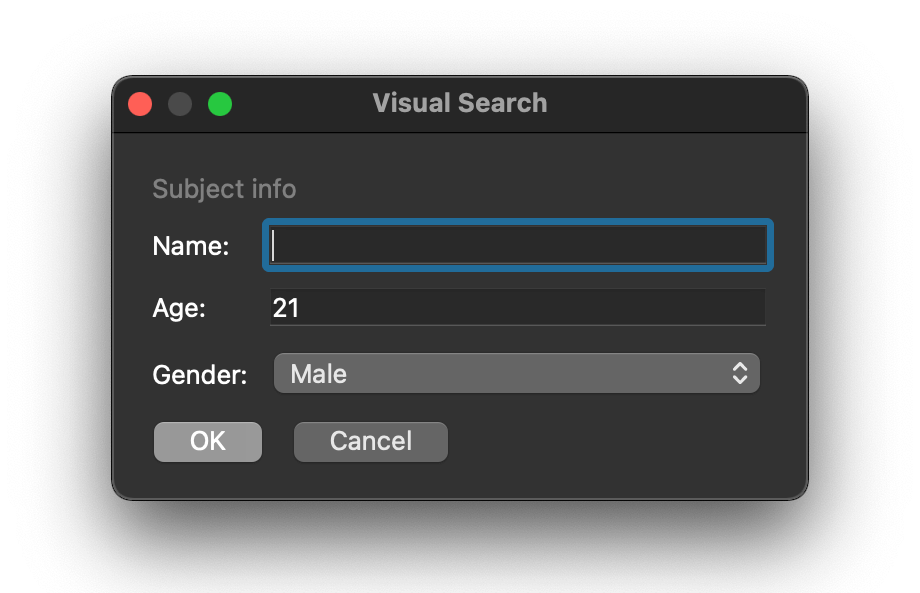
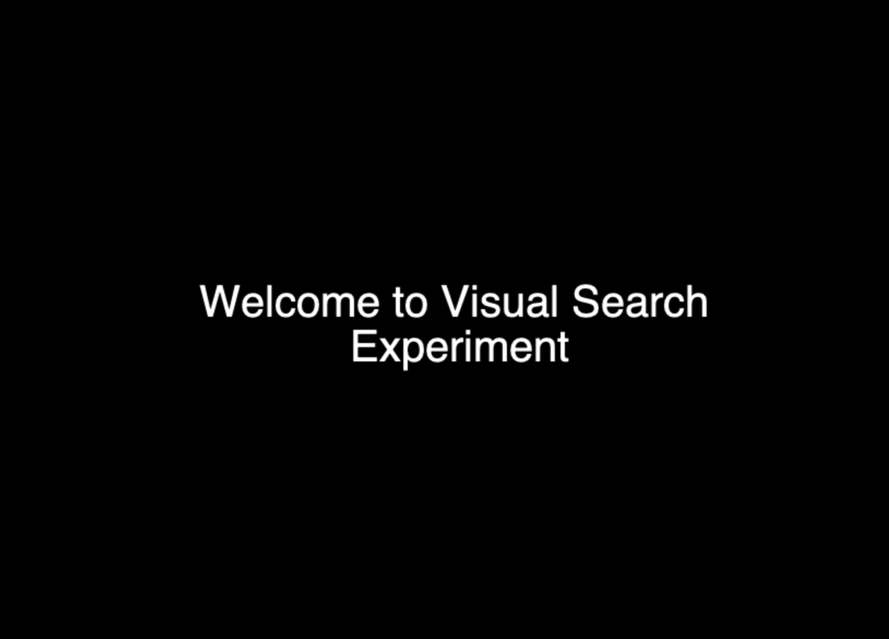
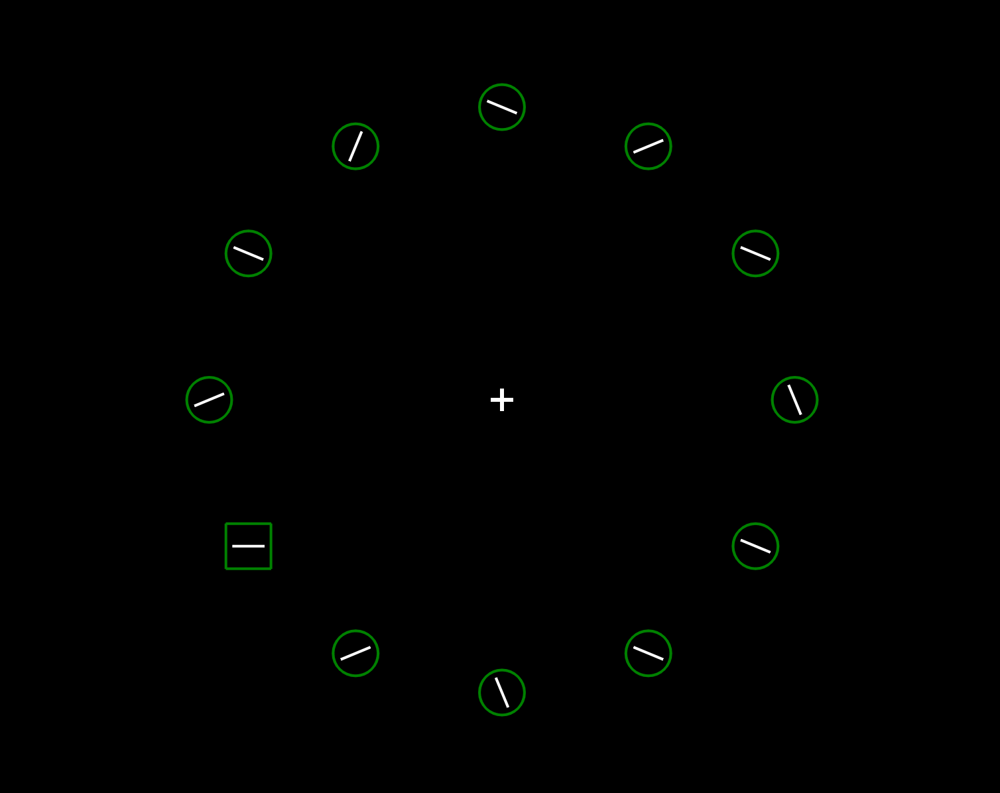
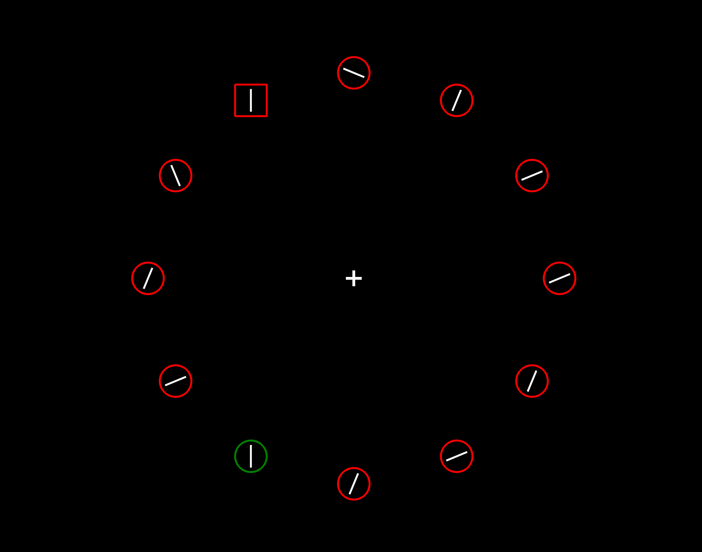
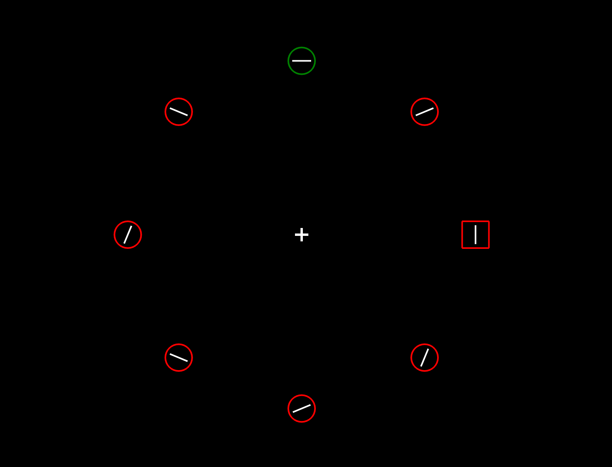

## Line-in-shape written using PsychoPy programmatically

The requirements for a visual search line-in-shape task were a little more demanding than the chapter 9 example.

For example, the number of shapes is not predetermined (from an array of coordinates) as it was in the previous example. Instead of creating 1-8 distractors and placing them in *random* locations, the line-in-shape program requires anywhere from 8 to 20 shapes that are oriented in a circle.

To display the stimuli in a circle, the positions must be calculated. This, however, depends on the number of stimuli which is determined randomly. In addition to determining the location of the stimuli and target based on the number of shapes, some trials have distractors and some do not. The lines are inside each of the stimuli must also be either 22.5 degrees from horizontal or vertical.

## Some dilemmas

The first problem that arises when trying to make this in builder interface would be: Should I make 20 components despite only having 8 or 12 for some trials? Setting the opacity to 0 for the unused one may work, but that means the coordinates of all the shapes must be stored in a conditions file and each of the possibilities must be enumerated in the csv. Another problem would be having to manually add the shape and line components (over 40) and setting the properties for each. This seemed very tedious and could be resolved using a simple for loop in code (the book also mentions this).

Next, onto the official guidelines.

## Guidelines

In each trial, there must be either 8, 12, 16, or 20 stimuli (this is randomly chosen). One of these stimuli will randomly be the target and the remaining stimuli will be circles. The rest of the stimuli will be circles. There will be lines in each of the shapes. For the non-targets, the line will be oriented either +22.5 or -22.5 degrees from horizontal or vertical. The line in the target will be either horizontal or vertical only.

***The task at hand is to identify the target (square) and respond with the correct orientation of the line inside the square.***

There are 3 main conditions:
1. No distractor present. All of the stimuli are colored green, and the randomly chosen target will be a square instead of a circle.
2. Distractor is present, and the line in the target and the distractor are matching (they are oriented the same way). All of the stimuli are red, the distractor is green, and the square target is one of the red.
3. Distractor is present, and the line in the target and the distractor are *not* matching (one will be horizontal, the other vertical). Once again, all of the stimuli are red, the distractor is green, and the square target is one of the red.

For now, keypresses are used to respond to the orientation of the line in the target. `Z` is horizontal and `M` is vertical.

The number of trials can be set to any number, and the program will create a distribution of trials such that half are condition 1 (no distractor), 25% are condition 2 (distractor matching), and the remaining 25% is condition 3 (distractor mismatch).

Response time will be measured in each of the trials and the output will be a CSV file.

<p align="center">
  
</p>

## How to run this program

1. At this point, there should already be a copy of python and the psychopy python framework on your device. If not, you can navigate to the [Mac setup](http://tmprk.github.io/psychopy-docs/docs/setup/mac-setup/) or [Windows setup](http://tmprk.github.io/psychopy-docs/docs/setup/windows-setup/).
2. Next, grab a copy of the program from github.

```bash
git clone https://github.com/tmprk/psychopy-visual-search
cd psychopy-visual-search
python main.py
```

After this, it should prompt you to enter your name and gender.
<p align="center">
  
</p>

Once you select okay, the you will be met with an instruction screen. It is pretty bare right now, as the main functionality was prioritized. Possible things to add are a demo of what is to be expected, and what the participant should press.
<p align="center">
  
</p>

The trials will begin, and you will encounter each of these. Click the tabs to see an example of each.




<p align="center">
  
</p>



<p align="center">
  
</p>




<p align="center">
  
</p>


