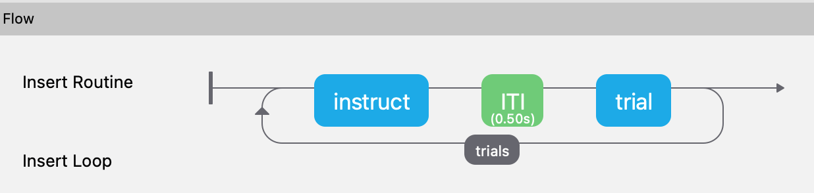
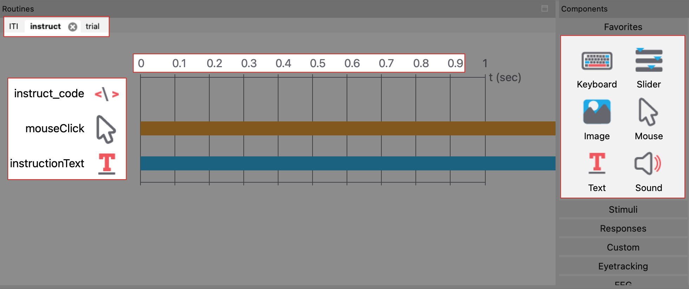
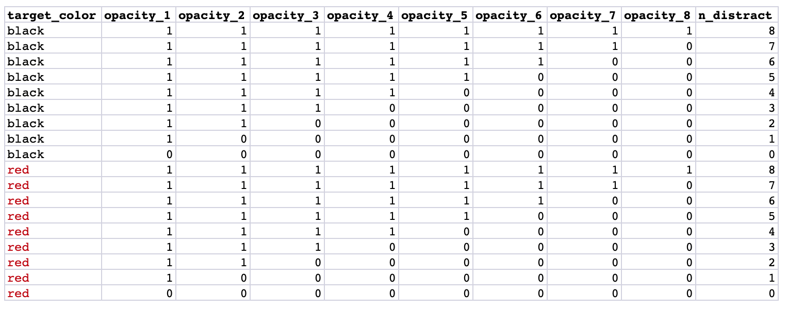
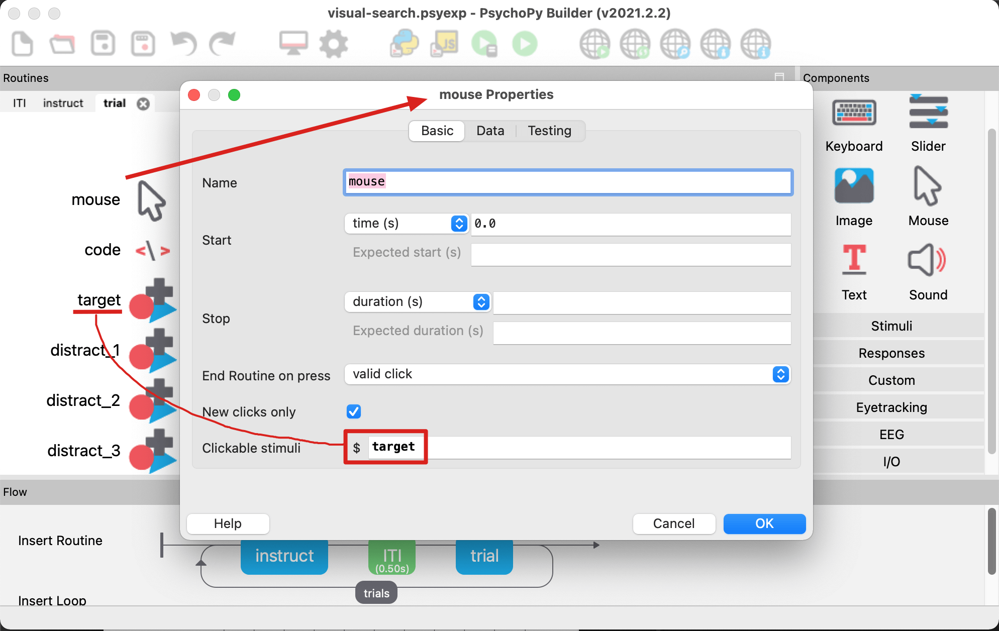
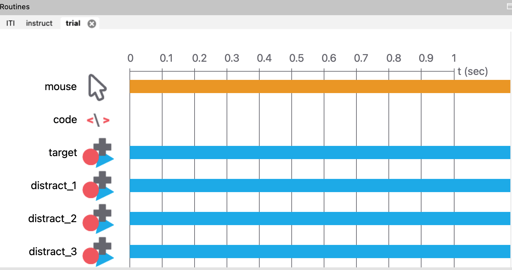
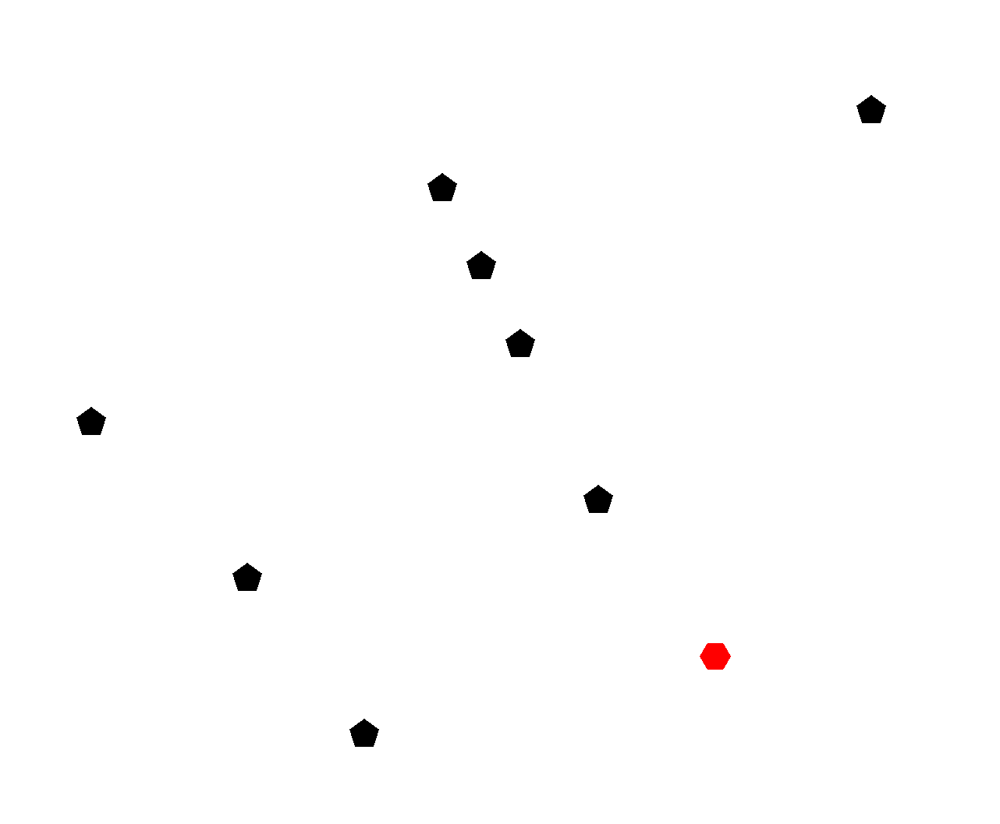
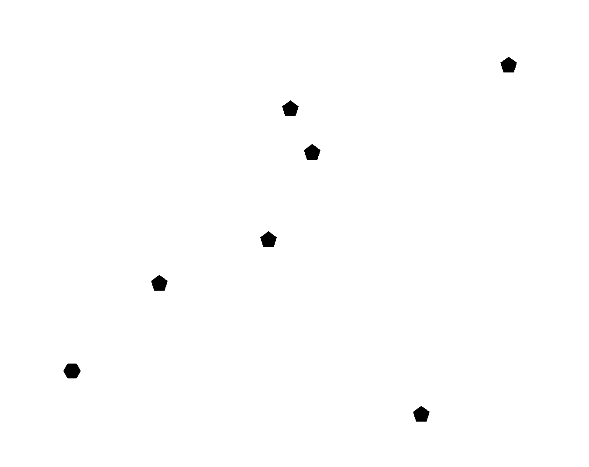
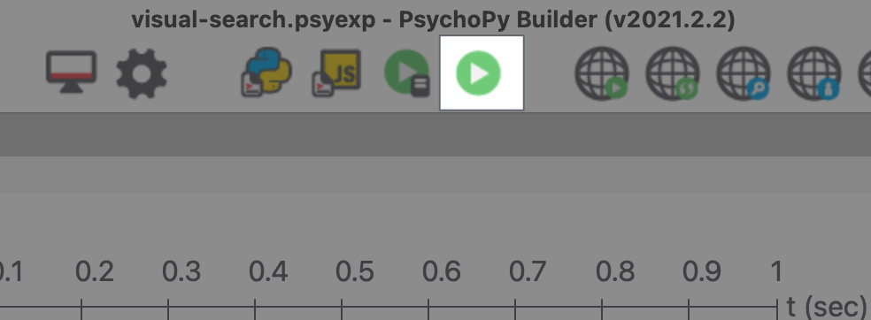

## PsychoPy Program of Visual Search (directly from Ch. 9)

In Psych 499, the end goal was to deploy and pilot a visual search program using the specifications of  *Interpersonal Competitiveness and Improvement in Reaction Time in a Visual Search. **Romero et al. 2015.** *

[Building Experiments in PsychoPy](https://uk.sagepub.com/en-gb/eur/building-experiments-in-psychopy/book253480) is a friendly introduction to exploring the PsychoPy user interface and learning how to use the tools it provides. Chapter 9 of this provides a step-by-step tutorial for a generic visual search using mouse as input. This was a good starting point for developing our own visual search program.

Many of these instructions may be redundant after looking through Chapter 9 of the book, but it provides an updated set of instructions and will attempt to elaborate more on the flow of a psychopy program in lay terms.

## Getting around PsychoPy
The flow of an experiment is made up of a sequence of **Routines**, which are made of **Components**. Here is an example of the final product of Chapter 9's example:
<p align="center">
  
</p>

Instruct, ITI, and trial are each routines. Think of them as individual sets of procedures that can be placed in an order or executed multiple times in experiment using loops. The reason why these are isolated is because each has their own sets of components that are added sequentially (see image below). The instruct routine is shown below and contains 3 components that are initialized in a specific order and last for a designated duration:

<p align="center">
  
</p>

## Building the visual search example

Here are the conditions of the experiment. This is served to the the "trials" loop that was shown earlier in the flow diagram. In 1 repetition,
 * There will be 16 total runs.
 * The 8 black runs are where all of the targets shown are black, making it harder to find the distinguish the hexagon from the pentagon distractors.
 * In the 8 red runs, the target is red while the distractors are black.
 * There is a different number distractors for each run, and all will occur only *ONCE*, unless the `n reps` is greater than 1.
<p align="center">
  
</p>

## Displaying the targets
To display the targets, a trial routine must be created. This is where the targets and mouse input are created.
1. A mouse component is created first to be able to watch for any mouse clicks. It ensures that the ***only*** clickable stimuli is the `target`, which can be enabled in mouse properties. The target is essentially a shape stimulus like the other distractors but is a black/red *hexagon*.
<p align="center">
  
</p>

2. A code object is created, which contains the randomized coordinates of each distractor.
```python
# initialized at the start of the entire experiment
x_pos = [-250, -150, -75, -25, 0, 25, 75, 150, 250]
y_pos = [-200, -150, -100, -50, 0, 50, 100, 150, 200]

# initialized at the start of the trial routine, before the objects are displayed
shuffle(x_pos)
shuffle(y_pos)
```
3. `distract_1-8` are all shape components that will be created and sent to the screen according to an `x_pos` and `y_pos` that was shuffled above. But only a few will be visible because the opacity is set to 0 for some of them.
	1. These are set to pentagons
	2. (x, y) position is `x_pos[0-8]`, `y_pos[0-8]`.
	3. Side note: This is obviously not an efficient approach, as it creates more resources at a time than needed. This can be circumvented by using the PsychoPy framework to write the same program from scratch.
4. This is what it the final result looks like.
<p align="center">
  
</p>

Finally, when the program is run, targets will appear on a screen, and the time it takes to identify the hexagon in a pool of pentagon distractors will be recorded when the mouse clicks on a "clickable stimuli". When the program has finished running, a CSV file will be generated containing the necessary data. The desired result looks like this:

Hexagonal target is red    |  Hexagonal target is black
:-------------------------:|:-------------------------:
  |  

## Link to the working program
[Here](https://www.dropbox.com/sh/t776ov6mkerje1r/AACUy3MeQdU9TAZg1BkMFFJ3a?dl=0) is the link to a working program. Simply download the folder and open the `.psyexp` file, which will prompt the PsychoPy builder to open.

Once opened, click the green play button at the top of the window. The experiment will start in full screen.
<p align="center">
  
</p>